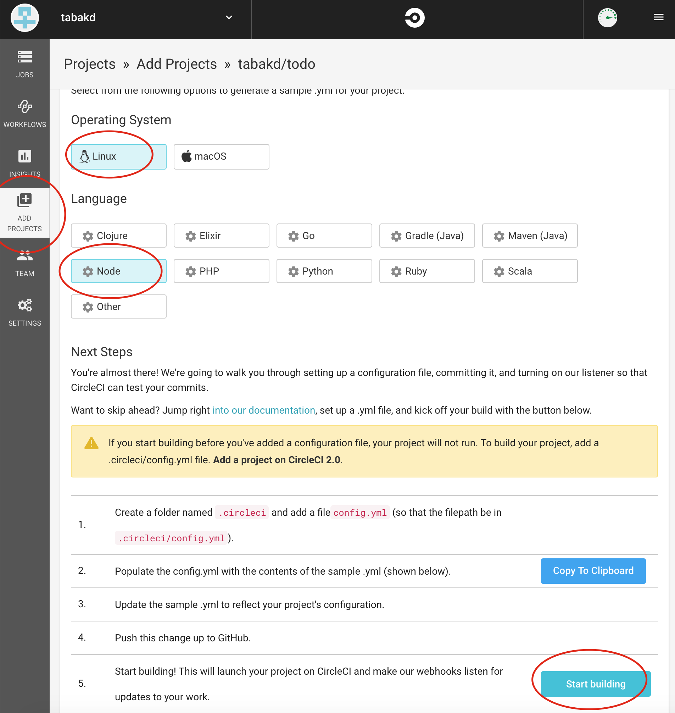
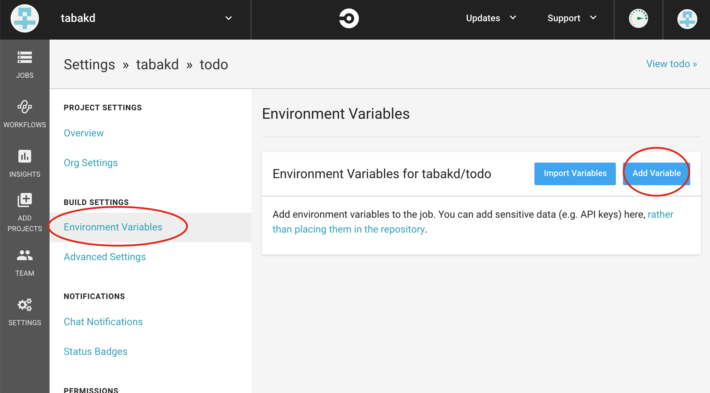
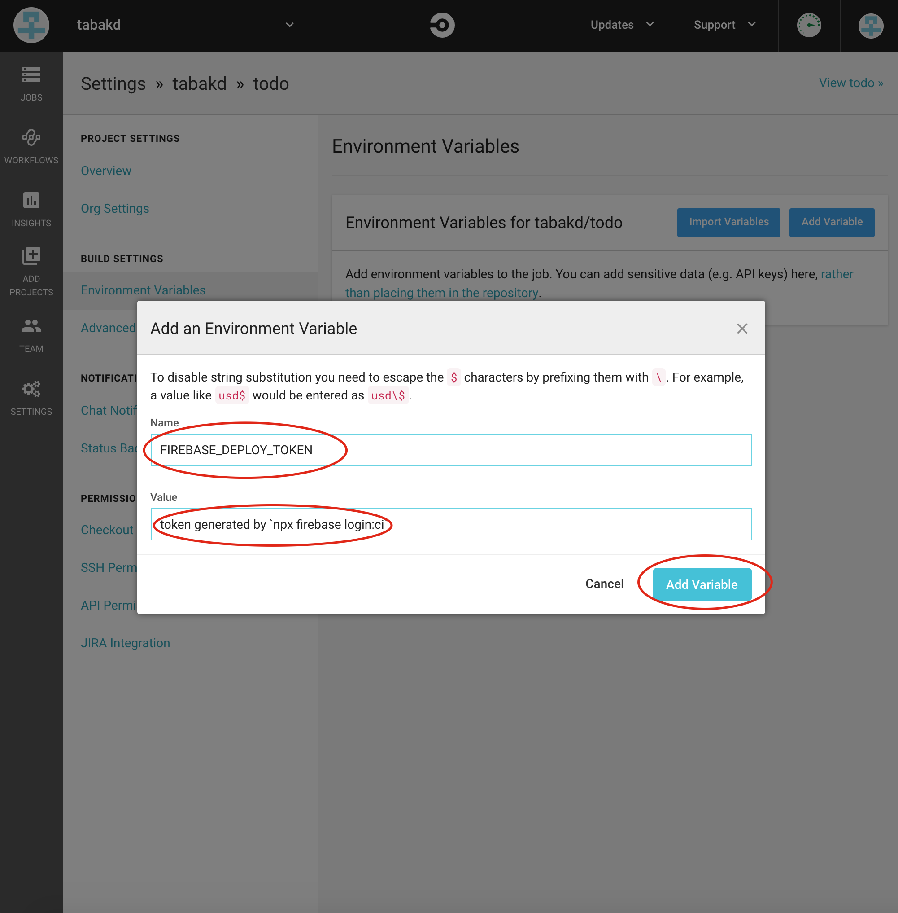

The New Maple client can be deployed using CircleCI.
CircleCI is configured to automatically build and then deploy to Firebase Hosting. The configuration can be accessed at [./config/circleci.yaml](../../.config/circleci.yaml)

To enable automatic frontend deployments:

1. Login to [CircleCI](circleci.com).
2. Add a new project.
   
3. Run `npx firebase login:ci` to generate a new deploy token.
4. Add the Firebase token to your CircleCI environment.
   
   
5. All Done! Commits to `master` will now automatically be deployed to Firebase Hosting.
